# 🎯 KMeans Clustering Analysis

<div align="center">
  
  [](https://python.org)
  [](https://scikit-learn.org)
  [](https://jupyter.org)
  [](https://numpy.org)
  
  
  
</div>

---

## 📋 **Project Overview**

**KMeans Clustering** is a powerful unsupervised machine learning algorithm that partitions data into `k` distinct clusters based on feature similarity. This project demonstrates clustering analysis on the famous **Iris dataset**, revealing natural groupings within the data without using target labels.

### 🎯 **Key Concepts**
- **Unsupervised Learning**: No target labels required
- **Centroid-based Clustering**: Groups data around cluster centers
- **Distance Minimization**: Uses Euclidean distance for optimal groupings
- **Iterative Optimization**: Refines cluster positions until convergence

---

## 📊 **Dataset Information**

<div align="center">

| **Dataset** | **Features** | **Samples** | **Type** |
|-------------|-------------|-------------|----------|
| 🌸 **Iris Dataset** | 4 numerical | 150 | Unsupervised |

</div>

**Features Used:**
- 🌿 **Sepal Length** (cm)
- 🌿 **Sepal Width** (cm) 
- 🌺 **Petal Length** (cm)
- 🌺 **Petal Width** (cm)

> *Note: Target labels (species) are ignored for true unsupervised learning*

---

## 🎨 **Visual Results**

<div align="center">

### 🎯 **Cluster Visualization**


*Data points grouped into distinct clusters with centroids marked*

### 📈 **Elbow Method Analysis**


*Optimal number of clusters determined using elbow method*

### 📊 **Silhouette Analysis**


*Clustering quality evaluation using silhouette scores*

</div>

---

## ⚙️ **Implementation Steps**

```mermaid
graph TD
    A[📥 Load Iris Dataset] --> B[🔧 Data Preprocessing]
    B --> C[📊 Exploratory Analysis]
    C --> D[📈 Elbow Method]
    D --> E[🎯 KMeans Training]
    E --> F[📋 Silhouette Analysis]
    F --> G[🎨 Visualization]
    G --> H[📊 Results Evaluation]
```



### 🔄 **Detailed Workflow**

1. **📥 Data Loading & Exploration**
   - Import Iris dataset (features only)
   - Analyze data distribution and correlations

2. **🔧 Data Preprocessing**  
   - Feature scaling and normalization
   - Handle any missing values (if present)

3. **📈 Optimal K Selection**
   - Apply Elbow Method
   - Calculate Within-Cluster Sum of Squares (WCSS)
   - Identify the optimal number of clusters

4. **🎯 KMeans Model Training**
   - Initialize centroids randomly
   - Iterative cluster assignment and centroid update
   - Convergence criteria evaluation

5. **📊 Model Evaluation**
   - Silhouette Score analysis
   - Cluster cohesion and separation metrics
   - Visual inspection of results

6. **🎨 Results Visualization**
   - 2D/3D cluster plots with centroids
   - Elbow curve visualization
   - Silhouette analysis plots

---

## 🛠️ **Tools & Technologies**

<div align="center">

<table>
<tr>
<td align="center">

<br><strong>Python</strong>
</td>
<td align="center">

<br><strong>Scikit-learn</strong>
</td>
<td align="center">

<br><strong>Matplotlib</strong>
</td>
<td align="center">

<br><strong>Seaborn</strong>
</td>
</tr>
<tr>
<td align="center">

<br><strong>NumPy</strong>
</td>
<td align="center">

<br><strong>Pandas</strong>
</td>
<td align="center">

<br><strong>Jupyter</strong>
</td>
<td align="center">
🎯<br><strong>KMeans</strong>
</td>
</tr>
</table>

</div>

---

## 📁 **Project Structure**

```
06-KMeans-Clustering/
├── 📓 KMEANS.ipynb                 # Main implementation notebook
├── 🖼️ kmeans_clusters.png          # Cluster visualization
├── 📈 kmeans_elbow.png             # Elbow method plot  
├── 📊 kmeans_silhouette.png        # Silhouette analysis
└── 📋 README.md                    # Project documentation
```

---

## 🎯 **Key Insights**

<div align="center">

| **Metric** | **Description** | **Importance** |
|------------|-----------------|----------------|
| 📊 **Silhouette Score** | Measures cluster quality | Higher = Better separation |
| 📈 **Elbow Point** | Optimal number of clusters | Balance complexity vs. performance |
| 🎯 **Centroids** | Cluster center points | Represent typical cluster characteristics |
| 📏 **WCSS** | Within-cluster variation | Lower = More cohesive clusters |

</div>

---

## 🚀 **Getting Started**

```bash
# Clone the repository
git clone https://github.com/yourusername/Machine-learning-blueprints.git

# Navigate to KMeans project
cd Machine-learning-blueprints/06-KMeans-Clustering

# Launch Jupyter Notebook
jupyter notebook KMEANS.ipynb
```

---

## 🔗 **Navigation**

<div align="center">

[](../README.md)

</div>

---

<div align="center">

### 🌟 **"Discovering patterns in chaos - that's the beauty of unsupervised learning!"** 🌟


</div>

---

<div align="center">
 
</div>
