# <div align="center">🧠 Machine Learning Blueprints</div>

<div align="center">
  
[](https://git.io/typing-svg)


**A comprehensive collection of machine learning algorithms implemented from scratch and with industry-standard libraries**

[](https://github.com/yourusername/Machine-learning-blueprints)

</div>

---

## 🎯 **Mission Statement**

> *"Transforming complex machine learning concepts into clear, implementable blueprints for aspiring data scientists, seasoned professionals, and curious minds alike."*

This repository serves as both a **personal portfolio showcase** and a **comprehensive learning resource**, demonstrating hands-on implementation of fundamental ML algorithms. Each project is crafted with attention to detail, from data preprocessing to result visualization, making it perfect for recruiters, students, and fellow practitioners.

---

## 📁 **Repository Architecture**

```
Machine-learning-blueprints/
│
├── 📊 01-Linear-Regression/
│   ├── linrear_regression.ipynb
│   ├── salary_data.csv
│   ├── linear_regression_result.png
│   └── README.md
│
├── 🌳 02-Decision-Trees/
│   ├── Descision_Tree.ipynb
│   ├── iris.csv
│   ├── decision_tree_result.png
│   └── README.md
│
├── 🎯 03-k Nearest Neighbors/
│   ├── knn.ipynb
│   ├── iris.csv
│   ├── knn_confusion_matrix.png
│   └── README.md
│
├── 🎲 04-Naive-Bayes/
│   ├── Naive_bayes.ipynb
│   ├── iris_dataset_preview.png
│   ├── iris_pairplot.png
│   ├── Naive_bayes_confusion_matrix.png
│   └── README.md
│
├── ⚡05-Support-Vector-Machine/
│   ├── Support_Vector_Machine.ipynb
│   ├── svm_confusion_matrix.png
│   ├── svm_decision_boundary.png
│   └── README.md
│
├── 📈 06-Logistic-Regression/
│   ├── Logistic_Regression.ipynb
│   ├── User_Data.csv
│   ├── logistic_regression_result.png
│   └── README.md
│
├── 🧠 07-Backpropagation/
│   ├── Backpropagation.ipynb
│   ├── User_Data.csv
│   ├── backpropagation_result.png
│   └── README.md
│
├── 🔀 08-Ensemble/
│   ├── Ensemble.ipynb
│   ├── ensemble_confusion_matrix.png
│   ├── ensemble_feature_importance.png
│   ├── ensemble_accuracy_comparison.png
│   └── README.md
│
├── 🎯 09-KMeans-Clustering/
│   ├── KMEANS.ipynb
│   ├── kmeans_clusters.png
│   ├── kmeans_elbow.png
│   ├── kmeans_silhouette.png
│   └── README.md
│
└── README.md 
```

---

## 🚀 **Algorithm Showcase**

###  **Linear Regression** | *Predicting the Future with Lines*

The cornerstone of predictive modeling, linear regression establishes relationships between variables through elegant mathematical simplicity. This implementation demonstrates both simple and multiple regression techniques with comprehensive statistical analysis.

**🎯 Key Achievement:**
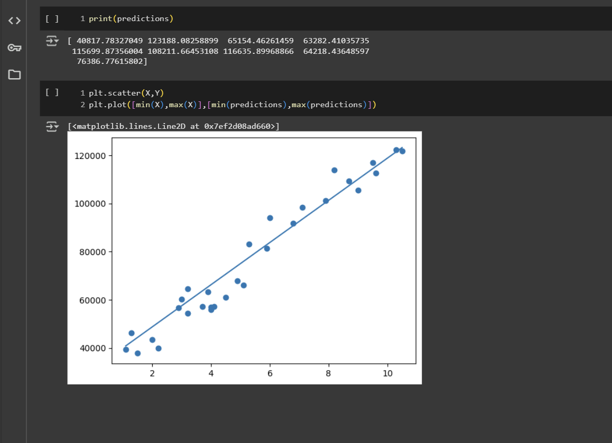

*Beautiful visualization showcasing perfect linear relationships and prediction accuracy*

**[🔍 Explore Full Implementation →](01-Linear-regression/)**

---

###  **Decision Trees** | *Logic That Branches*

Nature-inspired decision-making algorithm that splits data based on feature importance. This project showcases the interpretability power of tree-based models with stunning visualizations of decision boundaries.

**🌟 Visualization Magic:**
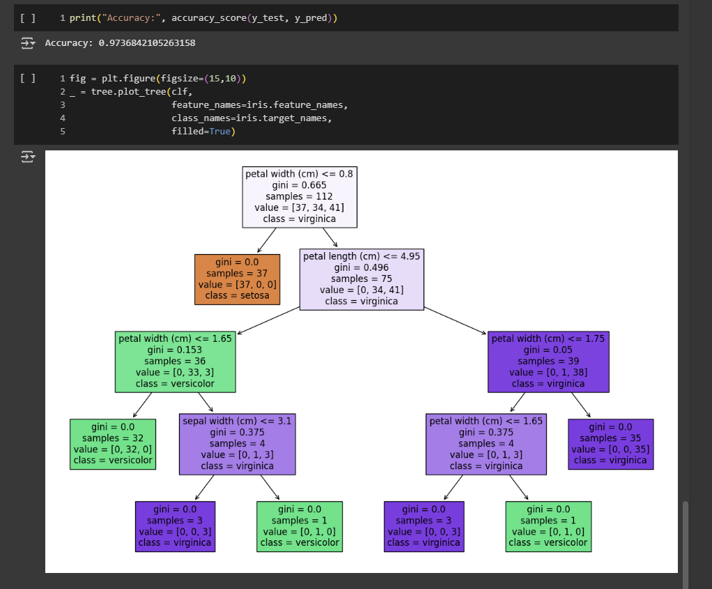

*Interactive tree structure revealing the algorithm's decision-making process*

**[🔍 Dive Into Decisions →](02-Decision_Trees/)**

---

###  **k-Nearest Neighbors** | *Friendship-Based Learning*

The intuitive algorithm that classifies based on proximity - "tell me who your neighbors are, and I'll tell you who you are." This implementation explores different distance metrics and optimization techniques.

**📊 Performance Analytics:**
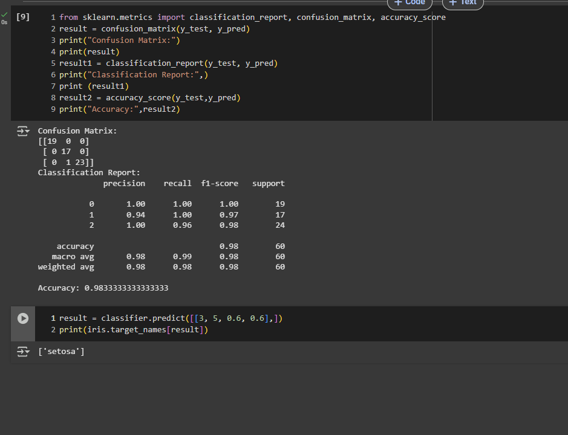

*Precision-crafted confusion matrix showcasing classification excellence*

**[🔍 Meet Your Neighbors →](03-k-Nearest-Neighbors/)**

---

###  **Naive Bayes** | *Probability Powerhouse*

Harness the power of Bayes' theorem for classification tasks. This project features comprehensive analysis of the famous Iris dataset with beautiful statistical visualizations.

**🌺 Dataset Deep Dive:**
<div align="center">
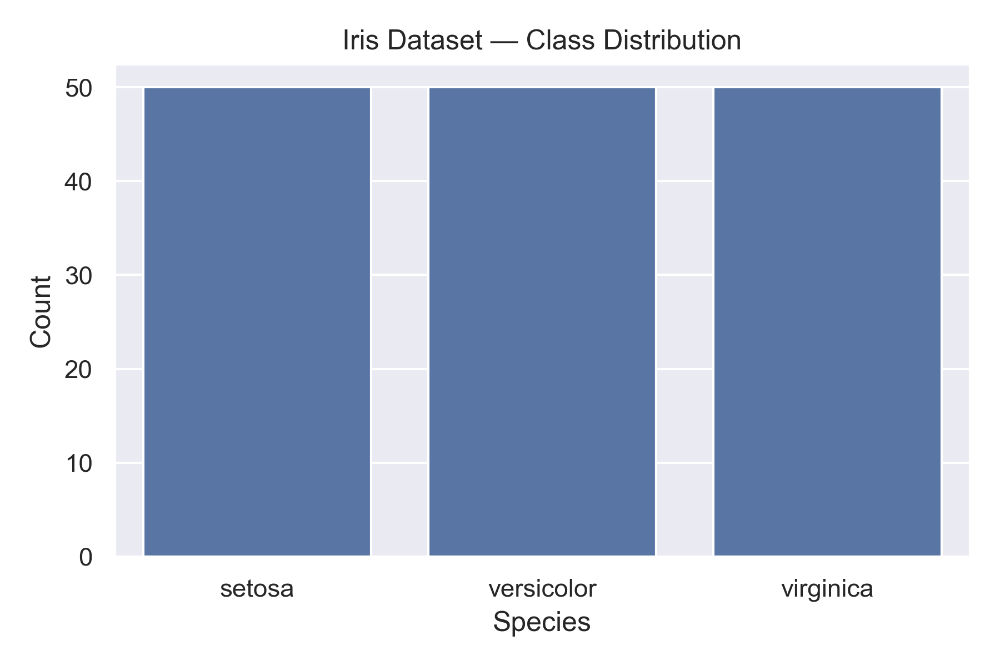
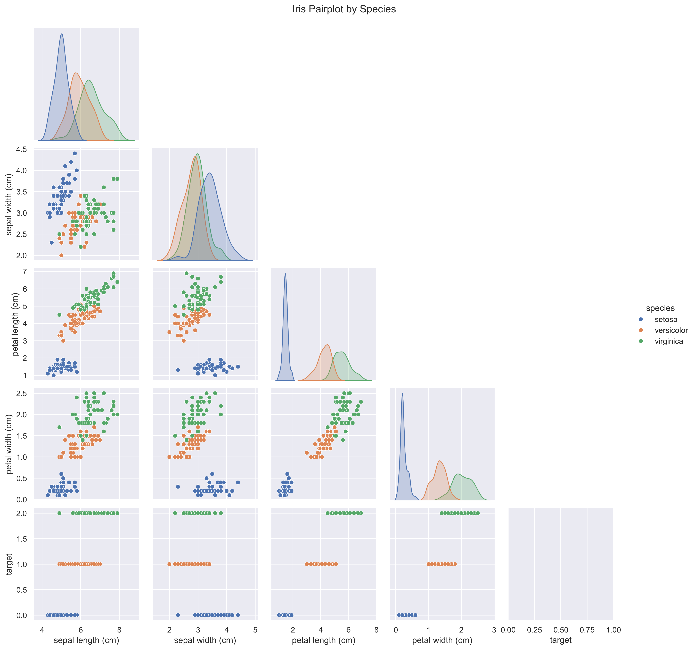
</div>

**🎯 Classification Mastery:**
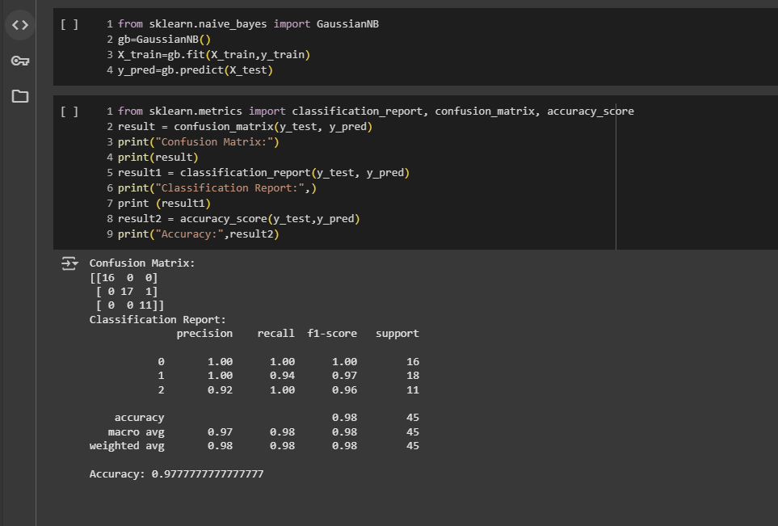

**[🔍 Explore Probabilistic Magic →](04-Naive-Bayes/)**

---

###  **Support Vector Machine** | *Maximum Margin Mastery*

The geometric genius of machine learning, SVMs find optimal decision boundaries with mathematical precision. This implementation showcases both classification and the beauty of kernel tricks.

**⚡ Dual Power Visualization:**
<div align="center">
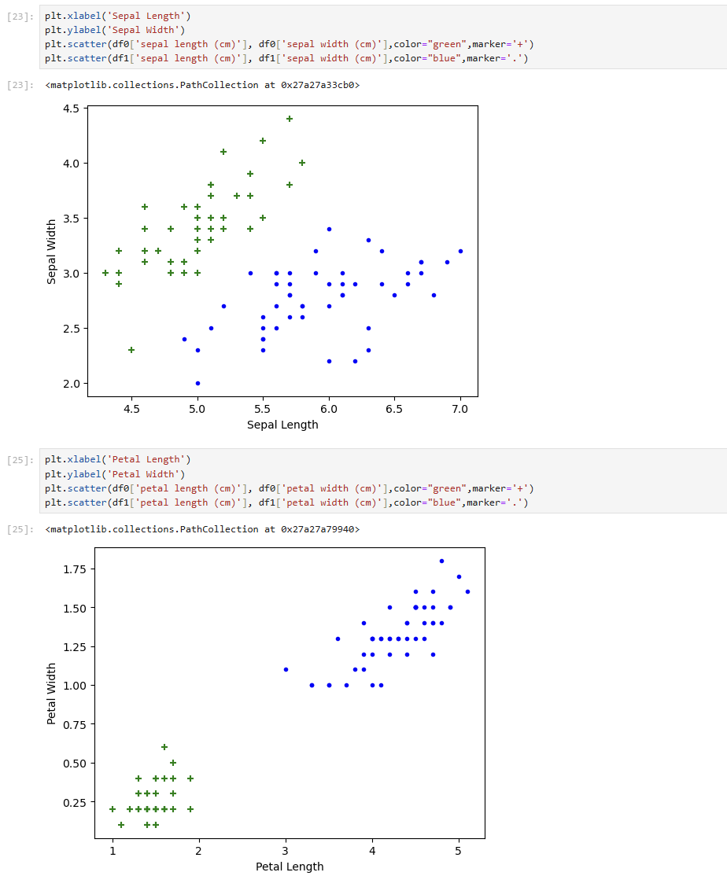

</div>

*Left: Elegant decision boundaries | Right: Classification performance metrics*

**[🔍 Master the Margins →](05-Support-Vector-Machine/)**

---

###  **Logistic Regression** | *Sigmoid Sophistication*

Where linear regression meets classification through the elegant sigmoid function. This project demonstrates the power of logistic regression in binary and multiclass scenarios.

**📈 Sigmoid Success:**
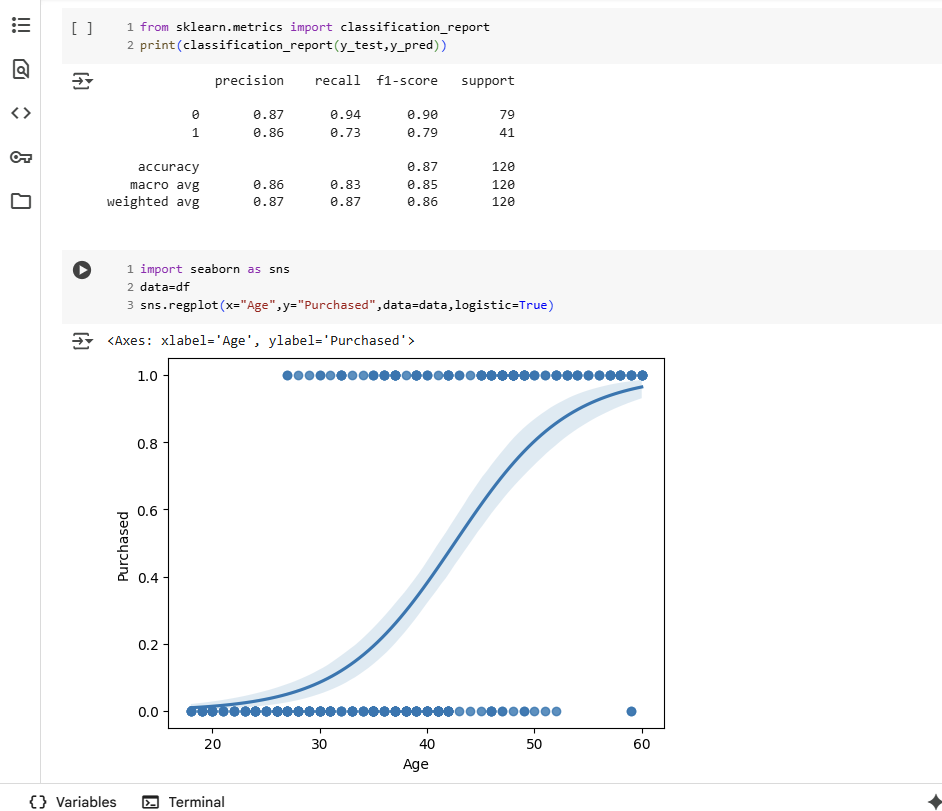

*Smooth probability curves showcasing classification confidence*

**[🔍 Sigmoid Into Success →](06-Logistic-Regression/)**

---

###  **Backpropagation** | *Neural Network Genesis*

The foundation of deep learning - understanding how neural networks learn through gradient descent and backpropagation. This implementation builds networks from scratch.

**🧠 Neural Architecture:**
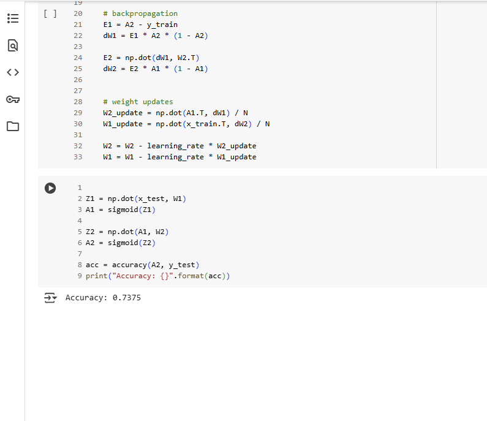

*Visualizing the learning process through gradient flow*

**[🔍 Dive Deep Into Neurons →](07-Backpropagation/)**

---

###  **Ensemble Learning** | *Collective Intelligence*

The wisdom of crowds applied to machine learning. This comprehensive project explores Random Forests, Gradient Boosting, and Voting classifiers with detailed performance comparisons.

**🔀 Triple Threat Analysis:**
<div align="center">
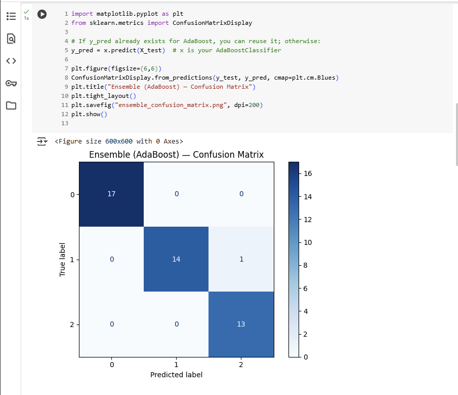
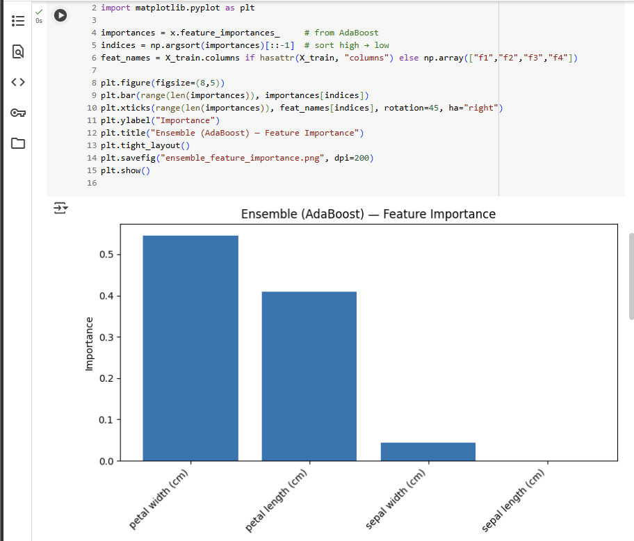
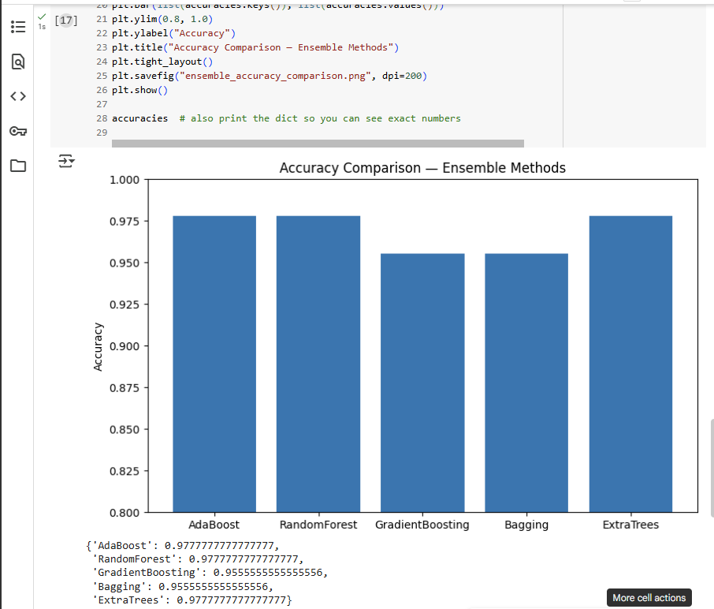
</div>

*Performance Matrix | Feature Insights | Model Comparison*

**[🔍 Unite The Algorithms →](08-Ensemble-Learning/)**

---

###  **K-Means Clustering** | *Unsupervised Discovery*

Discover hidden patterns in data without labels. This project showcases the complete clustering pipeline from optimal cluster selection to comprehensive evaluation metrics.

**🎯 Clustering Trinity:**
<div align="center">


</div>

*Cluster Visualization | Elbow Method | Silhouette Analysis*

**[🔍 Uncover Hidden Patterns →](09-KMeans-Clustering/)**

---

## 🛠️ **Technology Stack**

<div align="center">

| **Core Language** | **ML Framework** | **Data Analysis** | **Visualization** | **Environment** |
|:-:|:-:|:-:|:-:|:-:|
|  |  |  |  |  |
|  | | |  | |

</div>

---

## 🎓 **Learning Outcomes**

<div align="center">

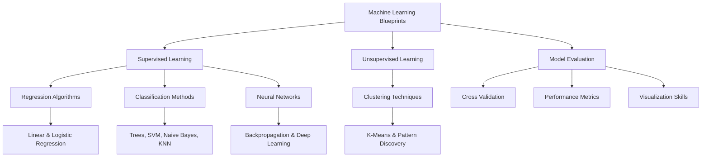

</div>

---

## 🌟 **What Makes This Special**

<table>
<tr>
<td width="50%">

### 🔬 **Research Quality**
- Comprehensive algorithm implementations
- Statistical rigor in every analysis
- Professional-grade visualizations
- Reproducible research practices

</td>
<td width="50%">

### 📚 **Educational Value**
- Step-by-step learning progression
- Clear documentation and comments
- Real-world dataset applications
- Theory-to-practice bridge

</td>
</tr>
<tr>
<td>

### 💼 **Industry Ready**
- Production-quality code structure
- Best practices implementation
- Scalable algorithm designs
- Portfolio-worthy demonstrations

</td>
<td>

### 🚀 **Innovation Focus**
- Creative visualization techniques
- Performance optimization insights
- Comparative analysis approaches
- Cutting-edge evaluation metrics

</td>
</tr>
</table>

---

## 🤝 **Connect & Collaborate**

<div align="center">

[](your-portfolio-link)
[](your-linkedin-profile)
[](https://github.com/yourusername)
[](mailto:your-email@example.com)

---

<div align="center">

**"Every algorithm tells a story. Every dataset holds secrets. Every model opens doors."**

[](https://git.io/typing-svg)


</div>

---

<p align="center">💡 Crafted with passion for Machine Learning & Data Science 🚀</p>
<p align="center">© 2025 Ruturaj | Machine Learning Blueprints</p>
<p align="center">
  
</p>

---

---
<p align="center">🤝 Contributions, suggestions, and feedback are always welcome!</p>
<p align="center">⭐ If you found this repo useful, don’t forget to star it!</p>
